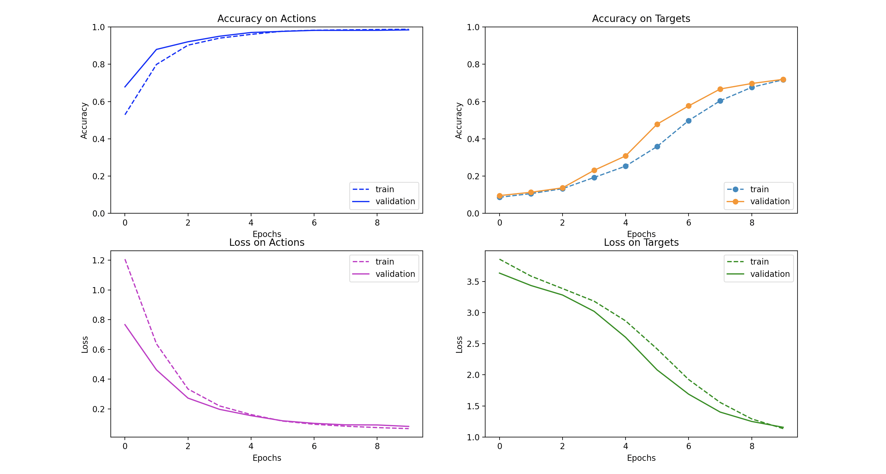
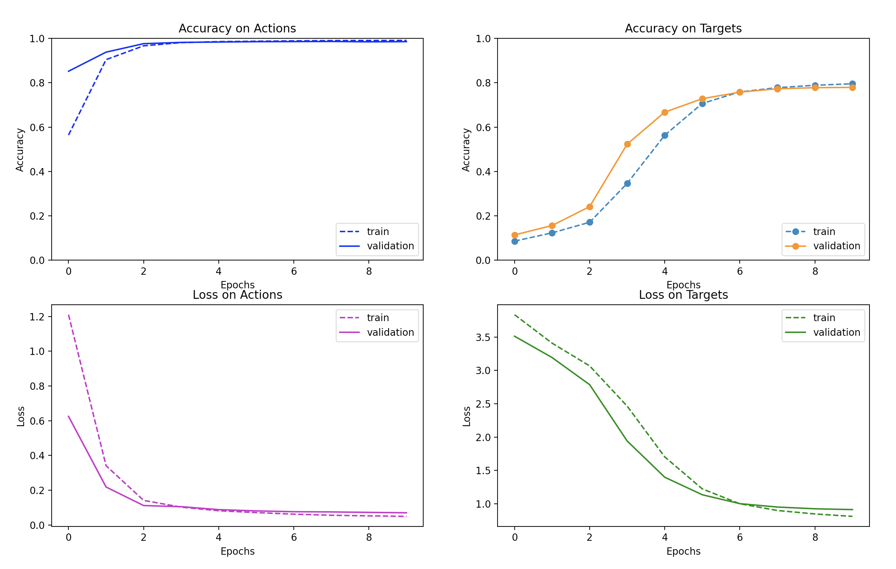
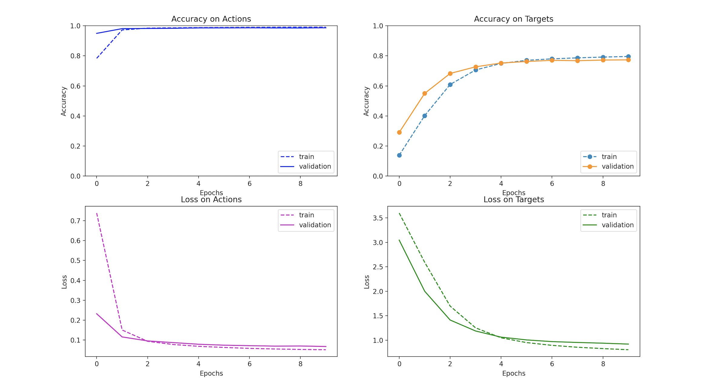

# LSTM for Text Classification

This repository implements an LSTM text classifier. Given a set of natural language instructions, the model classifies their relationship to discrete tasks in the [ALFRED](https://askforalfred.com/) environment. See the assignment below for more information about the task, data, and provided code.

To run the models described here, use ```run.sh. ```

## Tokenizers
The model begins by tokenizing the natural language instructions. It is equipped to run both word-level tokenization and byte-pair encoding. 

While byte-pair encoding is state of the art for natural language generation, using it for this task does not strongly benefit performance. The input distribution has relatively thin tails, with a 1000-token word-level vocabulary covering 98.7% of words in the training and validation sets. Further, the outputs are small set of discrete classes rather than the full input vocabulry, meaning BPE does not expand the range of the output. 

BPE is also notably slower than word-level tokenization. It takes about 10 minutes, compared to less than 1 minute for word-level. This is primarily driven by the step of encoding tokens after the BPE dictionary has already been built. Word-level tokenization allows a dictionary lookup of each word with time complexity of only O(1). But BPE must iterate from the longest to the shortest byte pairs, checking the string to be encoded for that pair at each step, resulting in time complexity of O(vocab_size). Better implementations of BPE would encode large batches of text inputs with a single pass through the dictionary, rather than encoding each word individually as implemented here. 

## Architecture
The model is a vanilla LSTM with the following layers:
* Embedding Layer with output dimension of 128
* LSTM with input and output dimension of 128
* Two independently trained classifier heads
    * Fully connected layer of input 128 and output 80
    * Fully connected layer of input 128 and output 8

Cross entropy is the objective function and Adam is the optimizer. Learning rate is 1e-2 for all experiments, and no other optimizer hyperparameters are utilized. 

I also tested feeding the fully-connected layers with a MaxPool of the LSTM's token-level outputs concatenated with its final hidden state. These experiments reduced the hidden state dimension to 64 so that, after concatenation, the fully-connected layer would receive the same 128 dimensions as the previous setup. Ultimately this setup performed worse than the original architecture. 


## Performance
Here is the performance chart for the best model, using word-level tokenization and no maxpool layer.



Switching to BPE does #TODO. 



Maxpool was an interesting idea, but also fails to improve performance. 



Each of these charts show evidence of some overfitting, with validation set performance consistently lagging behind training set performance. Dropout, early stopping, and data augmentation could all be used to combat this effect. 

Various tweaks that did improve performance over the course of debugging included:
* Setting the gradient of padding tokens to zero
* Lowercase for all characters prior to tokenization
* Larger batch sizes, from 100 to 20,000
* Using the Adam optimizer instead of SGD

To continue to improve performance, I would try:
* New LSTM hyperparameters such as width, depth, dropout, and bidirectional LSTMs
* Extracting semantic information from the output classes by breaking them into word pieces
* Longer training times with regularization and early stopping


# Coding Assignment #1

In this assignment, you will implement a basic semantic understanding model that classifies [ALFRED](https://askforalfred.com/) instructions based on the high-level action they are communicating and the target object they are communicating about.

ALFRED instructions were written by Mechanical Turk workers who aligned them to a virtual agent's behavior in a recorded simulation-based video of the agent doing a task in a room.

For example, the instructions for [an example task](https://askforalfred.com/?vid=8781) and their associated high-level action and object targets are:

| Instruction                                                                                                                          | Action       | Target     |
| :----------------------------------------------------------------------------------------------------------------------------------- | ------------:| ----------:|
| Go straight and to the left to the kitchen island.                                                                                   | GotoLocation | countertop |
| Take the mug from the kitchen island.                                                                                                | PickupObject | mug        |
| Turn right, go forward a little, turn right to face the fridge.                                                                      | GotoLocation | fridge     |
| Put the mug on the lowest level of the top compartment of the fridge. Close then open the fridge door. Take the mug from the fridge. | CoolObject   | mug        |
| Turn around, go straight all the way to the counter to the left of the sink, turn right to face the sink.                            | GotoLocation | sinkbasin  |
| Put the mug in the sink.                                                                                                             | PutObject    | sinkbasin  |

Initially, you should implement an LSTM model over the words in the instruction. We provide starter code that tokenizes the instructions and provides dictionaries mapping instruction tokens, action outputs, and target outputs to and from their numerical indexes. It's up to you to write methods that convert the inputs and outputs to tensors, an LSTM model that processes input tensors to produce predictions, and the training loop to adjust the parameters of the model based on its predictions versus the ground truth, target outputs.

You will evaluate your model as it trains against both the training data that it is seeing and validation data that is "held out" of the training loop. 

## Clone this repo
```
git clone https://github.com/GLAMOR-USC/CSCI499_NaturalLanguageforInteractiveAI.git

cd CSCI499_NaturalLanguageforInteractiveAI/hw1

export PYTHONPATH=$PWD:$PYTHONPATH
```

## Install some packages

```
# first create a virtualenv 
virtualenv -p $(which python3) ./hw1

# activate virtualenv
source ./hw1/bin/activate

# install packages
pip3 install -r requirements.txt
```

## Train model

The training file will throw some errors out of the box. You will need to fill in the TODOs before anything starts to train.
While debugging, consider taking a small subset of the data and inserting break statements in the code and print the values of your variables.

```
Train:
python train.py \
    --in_data_fn=lang_to_sem_data.json \
    --model_output_dir=experiments/lstm \
    --batch_size=1000 \
    --num_epochs=100 \
    --val_every=5 \
    --force_cpu 

Evaluation:
python train.py \
    --in_data_fn=lang_to_sem_data.json \
    --model_output_dir=experiments/lstm \
    --batch_size=1000 \
    --num_epochs=100 \
    --val_every=5 \
    --force_cpu \
    --eval


# add any additional argments you may need
# remove force_cpu if you want to run on gpu
```


## Grading

In this assignment you **may not** use HuggingFace libraries and implementations. Anything in the base `torch` library is fair game, however.
This assignment will be scored out of 25 points on the *correctness* and *documentation detail and accuracy* of the following aspects of your code:

- [ ] (5pt) Encoding the input and output data into tensors
- [ ] (10pt) Implementation and of the LSTM model
- [ ] (10pt) Implementation of the training and evaluation loops
- [ ] (5pt) *Report* your results through an .md file in your submission; discuss your implementation choices and document the performance of your model (both training and validation performance) under the conditions you settled on (e.g., what hyperparameters you chose) and discuss why these are a good set.

Remember that each coding assignment will be woth 25 points, for a total of 100 points towards coding assignments which account for 25% of your course grade.

## Available Bonus Points

You may earn up to 10pt of *bonus points* by implementing the following bells and whistles that explore further directions. For these, you will need to compare the performance of the base model against whatever addition you try. Add those details to your report. If you implement bonus items, your base code implementing the main assignment must remain intact and be runnable still.

- [ ] (*5pt*) Initialize your LSTM embedding layer with [word2vec](https://mccormickml.com/2016/04/12/googles-pretrained-word2vec-model-in-python/), [GLoVE](https://nlp.stanford.edu/projects/glove/), or other pretrained *lexical* embeddings. How does this change affect performance?
- [ ] (*5pt*) The action and the object target may be predicted via independent classification heads. Compare independent classification heads to a setup where the target head also takes in the predictions of the action head, as well as a setup where the action head takes in the predictions of the target head. How do these setups change performance?
- [ ] (*10pt*) The provided code does vanilla, word-level tokenization. Explore stemming (up to 5pt) or [BPE](https://en.wikipedia.org/wiki/Byte_pair_encoding) (used by BERT and friends; up to 10pt) tokens instead. If you use BPE, note that here you may still not use HuggingFace libraries, so you'll have to custom-roll your BPE tokenizer. If you perform stemming, you can try an off-the-shelf stemmer.
- [ ] (*10pt*) Perform a detailed analysis of the data itself or of your model's performance on the data. This bonus is very open ended, and points will be based on the soundness of the implementation as well as the insights gained and written up in the report. For example, you could cluster instructions based on learned embeddings, or even just by looking at token frequencies, and see clusters correspond to action or object targets in any consistent way. You could also analyze which training or validation examples your model gets wrong with high confidence (e.g., most probability mass on the wrong choice at prediction time) and see, qualitatively, if you can identify systematic misclassifications of that type and hypothesize about why they happen.
- [ ] (*10pt*) We used a word-level tokenizer. What happens if you try to use a character-level model? Likely the sequences will just be too long! What happens if you swap your LSTM out for a CNN-based model that operates on characters? Note you'll have to write new preprocessing code to try this.
- [ ] (*10pt*) Some instructions don't include enough information in the single instruction text to let the model know what to do. Expand the *context* of the classification task by considering the previous instruction, the next instruction, or both when training and making predictions. Note that this change will require different preprocessing code, since you'll need to ensure instruction sets "stay together". 
- [ ] (*10pt*) How does the LSTM method you implemented compare to a BERT-based approach? For this bonus item **only**, you may utilize HuggingFace to encode instructions using a pretrained BERT. How does the LSTM compare to learning action and target classification heads on top of the BERT embedding?
